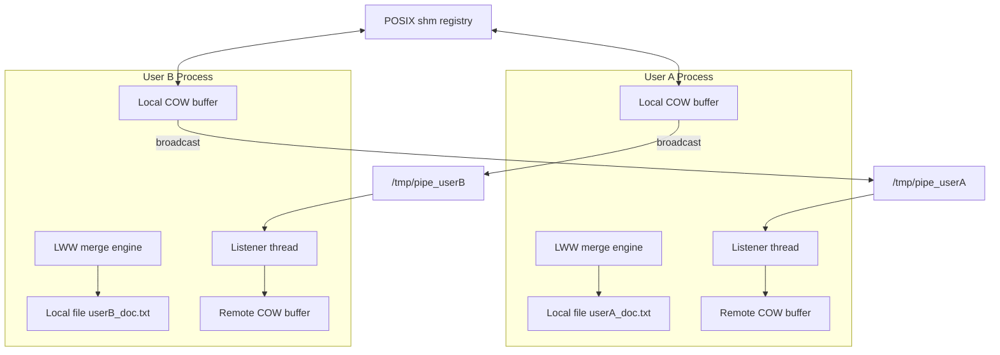

# CRDT-Based Collaborative Text Editor

A multi-process collaborative text editor built with UNIX system primitives: POSIX shared memory, named pipes (FIFOs), and lock-free copy-on-write buffers. Concurrent edits converge with a CRDT-style Last-Writer-Wins (LWW) merge. There is no network stack and no third-party runtime; collaboration is local IPC only.

## Table of Contents

- [Overview](#overview)
- [Features](#features)
- [Architecture](#architecture)
- [Implementation](#implementation)
- [Build](#build)
- [Usage](#usage)
- [Benchmarks](#benchmarks)
- [Limitations](#limitations)
- [Design Document](#design-document)
- [License](#license)

## Overview

Each user runs a separate process. The process:

1. Registers in a shared-memory user registry.
2. Creates a per-user FIFO for incoming updates.
3. Watches its local document for edits (`kqueue` on macOS, `stat()` polling on Linux).
4. Broadcasts structured replace operations to every other registered user.
5. Merges local and remote operations with LWW conflict resolution.

The registry is capped at 5 concurrent users. Merge is batched (default threshold 5 pending operations).

## Features

- Lock-free update buffers using C++17 atomic `shared_ptr` copy-on-write snapshots
- POSIX shared-memory registry for process discovery (`/sync_registry`)
- Named-pipe IPC with a blocking listener (dummy writer keeps the FIFO open)
- Prefix/suffix span extraction so IPC carries a changed region, not the whole file
- LWW merge on overlapping column ranges; equal timestamps break ties by user ID
- macOS `kqueue` vnode watches; Linux falls back to 2s `stat()` polling
- Headless A/B microbenchmarks (`--bench`) that write `bench_results.md`
- Signal-safe cleanup of FIFOs, ready files, and registry entries

## Architecture



## Implementation

### Shared-memory registry

`shm_open` / `mmap` map a `Registry` of up to 5 user IDs. Registration and unregistration are serialized with `flock` so `user_count` is not racy across processes.

### Named pipes

Each process owns `/tmp/pipe_<user_id>`. Broadcasts open peer FIFOs `O_WRONLY | O_NONBLOCK` so a missing receiver cannot stall the sender. The listener opens a dummy write end so a blocking `read` does not see EOF when no peer is connected.

### Lock-free buffers

`local_ptr`, `recv_ptr`, and `recent_ptr` are `shared_ptr` snapshots swapped with `atomic_load` / `atomic_compare_exchange_weak` / `atomic_exchange`. Writers copy, append, and CAS; readers never take a mutex.

The registry is **not** lock-free; only the in-process update queues are.

### Change detection

On save, the watcher diffs old vs new lines and emits a `replace` operation (`UpdateObject`, 608 bytes) with line, column span, old/new text, nanosecond `CLOCK_REALTIME` timestamp, and user ID.

### Conflict resolution

For two operations on the same line whose column ranges overlap:

1. The later timestamp wins.
2. If timestamps are equal, the lexicographically smaller user ID wins.

Surviving operations on a line are applied right-to-left by `start_col`.

### File watch

| Platform | Default | Override |
| --- | --- | --- |
| macOS | `kqueue` (`EVFILT_VNODE`) | `./CRDT --poll <user>` |
| Linux | 2s `stat()` poll | (kqueue is not available) |

## Build

Requires a C++17 compiler and pthreads.

```bash
g++ -std=c++17 -O2 CRDT2.cpp -o CRDT -lpthread
```

On macOS, link with the system libc (default). Linux builds automatically use the poll watcher.

## Usage

Start one process per user in separate terminals:

```bash
./CRDT user_1
./CRDT user_2
```

Each process registers in `/sync_registry`, creates `/tmp/pipe_<user_id>`, and creates `<user_id>_doc.txt` if it does not exist.

Edit a document in another terminal:

```bash
nano user_1_doc.txt
```

Save. Peers receive the update, merge when the pending-op threshold is reached, and rewrite their local file.

```bash
./CRDT --poll user_1     # force 2s stat() watch (also the Linux default)
./CRDT --bench           # microbenchmarks; writes bench_results.md
```

Stop with `Ctrl+C`. The process unregisters, unlinks its FIFO, and removes `/tmp/crdt_ready_<user_id>`.

## Benchmarks

Figures below are from `./CRDT --bench` on this machine (`CLOCK_MONOTONIC`, `g++ -std=c++17 -O2`). Re-run before citing them elsewhere. Full tables: [`bench_results.md`](bench_results.md).

| Experiment | Baseline | Optimized | Notes |
| --- | --- | --- | --- |
| File-watch detect p50 | 2.0 s (`stat()` poll) | 43.5 µs (`kqueue`) | Poll interval is 2 s by construction |
| FIFO IPC p50 | 102.3 ms (100 ms poll) | 50.5 µs (blocking + dummy writer) | Write to listener `read` complete |
| Merge wall (200 ops) | 32.82 ms (threshold 1) | 4.82 ms (threshold 5) | 5× fewer file rewrites; 6.81× wall-clock |
| A→B converge p50 | 1.3 s (poll) | 17.8 ms (`kqueue`) | 2 processes, 5 non-overlapping line edits |

Converge `n` counts successful trials only (kqueue 7/12, poll 3/4). Span extraction on short edits of an 80-line document is 96% smaller than sending both full lines; a 608-byte op is 90% smaller than sending the whole file.

## Limitations

- Collaboration is same-machine only (FIFOs and POSIX shm).
- Registry capacity is 5 users.
- Operations are line-span replaces, not character-level CRDTs (RGA, WOOT, etc.).
- Equal-timestamp ties are resolved by user ID, not by a vector clock.
- End-to-end converge is sensitive to file-watch latency; Linux uses the 2 s poll path.

## Design Document

See [`CRDT_DESIGNDOC.pdf`](CRDT_DESIGNDOC.pdf) for the full design write-up.

## License

MIT. See [LICENSE](LICENSE).

## Author

Harsh Jain  
Operating Systems project — collaborative lock-free text editor  
C++17, POSIX shared memory, named pipes, pthreads, C++17 atomics
